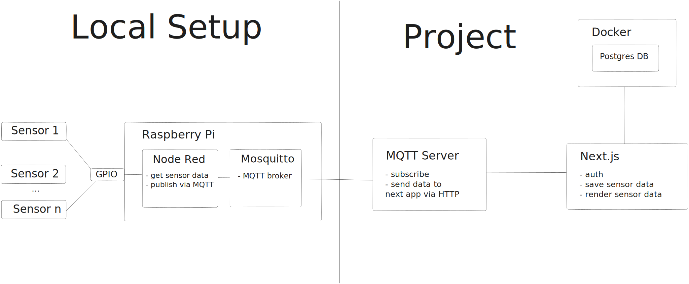
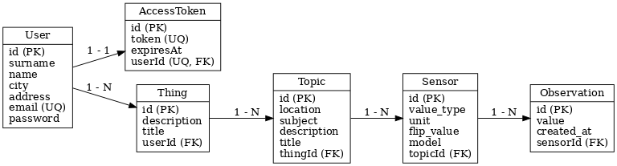

## Info

Formerly a playground to test out ui concepts and designs that turned into an actual project:

## The Project

Create a tool that monitors my room and collects data from sensors, such as temperature, humidity of my plant and how many people enter my room on a daily basis.
This project contains the db, the frontend and the subscriber script for mosquitto that sends data received via mqtt to next.js app.
In my local setup, I am using raspberry pi 4 with az delivery sensors, node red for grapping sensor data that is published to mosquitto via mqtt.

## Note

This is still work in progress

## Overview

## Start

- create .env based on .env.example
- 'npm install'
- spin up db with 'docker compose up'
- run migrations: 'npx prisma migrate deploy'
- start next.js app with: 'npm run dev' or build first, then 'npm run start'
- set up .env file in mqtt folder, 'npm install', 'node server' (if you have broker like mosquitto set up)
- if you only want to look at the next.js frontend: seed sample data with 'npm run prisma-seed' - username is admin@example.com/root OR
- add sample data via db gui: 'npm run db-gui'

## Features

- simplified version of oAuth login
- change theme color
- MQTT subscription server
- cockpit to render room data (still in progress)

## UML

